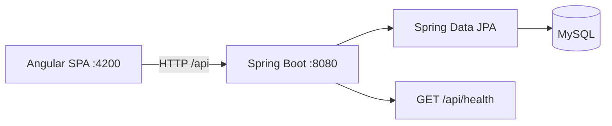

# JPetStore — Version 1 Foundation

A clean full-stack foundation for a modern JPetStore-style application. This version establishes the catalog data model, Spring Boot API base, Angular application shell, and development integration contract. It intentionally does not include authentication, catalog browsing APIs, cart, checkout, or orders.

## Simple implementation approach

This project deliberately uses beginner-friendly patterns so it is easy to explain:

- Java uses regular classes, constructors, and getters/setters—no Lombok or Java records.
- Spring Boot uses familiar `@Controller`, `@Service`, `@Repository`, and `@Entity` layers.
- Angular uses the classic `AppModule`, `AppRoutingModule`, constructor injection, and `*ngIf`/`*ngFor` templates.
- MySQL tables are generated from the three JPA entity classes.

### How to explain it to a mentor

1. Angular starts on port 4200 and calls the Spring Boot API on port 8080.
2. `CorsConfig` allows only the configured Angular origin to make that browser request.
3. `HealthController` is the first API and confirms that the application is running.
4. JPA maps `Category`, `Product`, and `Item` to three MySQL tables. One category has many products; one product has many items.
5. `CatalogSeedConfig` inserts five starter categories when the database is empty.
6. Repositories provide database access; controllers will use services and DTOs as more features are added.

## Architecture



## Technology stack

- Frontend: Angular 18, TypeScript, Router, HttpClient, RxJS
- Backend: Java 17, Spring Boot 3, Spring Web, Spring Data JPA, Bean Validation, Maven
- Database: MySQL 8+

## Prerequisites

- JDK 17 or later
- Maven 3.9+ (or add a Maven wrapper)
- Node.js 20.11+ and npm
- MySQL 8+

## MySQL setup

Open MySQL Workbench, open [database/jpetstore_setup.sql](database/jpetstore_setup.sql), and run it. It creates the database, three tables, and five categories with simple `INSERT` queries.

For a local demo, set your own MySQL login before starting Spring Boot. PowerShell example:

```powershell
$env:DB_URL='jdbc:mysql://localhost:3306/jpetstore'
$env:DB_USERNAME='root'
$env:DB_PASSWORD='your-local-password'
$env:CORS_ALLOWED_ORIGINS='http://localhost:4200'
```

`application.properties` contains only environment-variable placeholders and local development defaults; never commit real credentials. Spring Boot checks the database when it starts. Its Java seed class only inserts the same starter data if the tables are empty.

## Start the backend

```powershell
cd backend
mvn spring-boot:run
```

Verify the health endpoint:

```powershell
Invoke-RestMethod http://localhost:8080/api/health
```

Expected response:

```json
{ "status": "UP" }
```

Run backend tests:

```powershell
mvn test
```

Tests use an in-memory H2 database and verify the health endpoint; MySQL is not required for that test suite.

## Start the frontend

```powershell
cd frontend
npm install
npm start
```

Open `http://localhost:4200`. The app’s HTTP foundation calls `http://localhost:8080/api/health`; CORS permits only configured origins, defaulting to the Angular development server.

Build the frontend:

```powershell
npm run build
```

## Project structure

```text
backend/src/main/java/com/example/jpetstore/
├── config/       CORS and seed-data setup
├── controller/   HTTP endpoints
├── dto/          API contracts
├── entity/       Category → Product → Item
├── exception/    Global REST error handling
├── repository/   Spring Data repositories
└── service/      Service boundary reserved for later versions
frontend/src/app/
├── core/         API config, HTTP service, layout
├── shared/       Reusable presentational components
└── features/     Home now; feature routes reserved for later
```

## API and error contract

`GET /api/health` returns `{ "status": "UP" }`.

All foundation-level API errors use a consistent shape:

```json
{
  "timestamp": "2026-08-16T00:00:00Z",
  "status": 400,
  "error": "Bad Request",
  "message": "Validation failed",
  "path": "/api/example",
  "fieldErrors": { "field": "must not be blank" }
}
```

## Feature status

Implemented: application shell, responsive header/navigation, home categories, placeholder routes, reusable loading/error components, API configuration, backend health API, CORS, entities, repositories, MySQL configuration, and seed data.

Intentionally deferred: catalog API/UI, account and authentication, cart, checkout, orders, payment, authorization, and production deployment hardening.

## Future versions

1. v2.0-catalog — catalog read APIs and browsing UI
2. v3.0-authentication — registration, login, account profile
3. v4.0-shopping-cart — cart persistence and UI
4. v5.0-checkout-orders — checkout and order history
5. v6.0-production-ready — security hardening, observability, deployment
