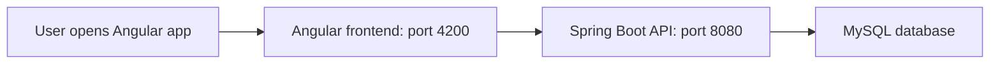
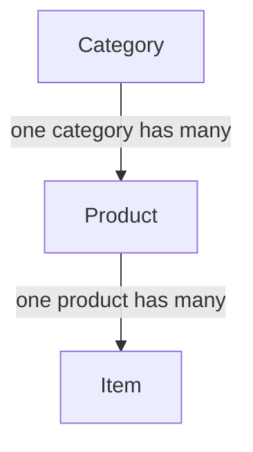

# JPetStore Version 1 — Foundation Explanation Guide

## 1. Version summary

Version 1 creates the base of the JPetStore project. It does not try to build the complete online pet store yet.

The aim is to make sure that:

- the Angular frontend can start;
- the Spring Boot backend can start;
- Angular can talk to Spring Boot;
- Spring Boot can connect to MySQL;
- MySQL has the basic catalog tables and sample data.

Features such as login, registration, product browsing, cart, checkout, and orders are intentionally not included in this version.

## 2. Simple explanation to give a mentor

> “I first created the foundation of the application. The frontend is Angular and runs on port 4200. The backend is Spring Boot and runs on port 8080. The frontend sends requests to the backend. The backend connects to MySQL and stores the catalog data. I added a health API to check whether the backend is running. I also added the basic database structure for categories, products, and items. The next versions can build more features on this foundation.”

## 3. Technology used

| Part | Technology | Why it is used |
|---|---|---|
| Frontend | Angular | Creates the web pages and navigation. |
| Backend | Java and Spring Boot | Creates REST APIs and application logic. |
| Database | MySQL | Stores categories, products, and items. |
| Database mapping | Spring Data JPA | Connects Java classes to MySQL tables. |
| Build tool | Maven | Downloads backend libraries and runs the backend. |

## 4. Overall flow



### What happens when the home page opens

1. The user opens Angular in the browser.
2. Angular shows the header, navigation links, and five category cards.
3. Angular calls `GET /api/health` on Spring Boot.
4. Spring Boot returns `{ "status": "UP" }`.
5. If the backend is unavailable, Angular shows a simple error message.

## 5. Backend explanation

Backend source location: `backend/src/main/java/com/example/jpetstore/`

| Folder | Purpose |
|---|---|
| `config` | Configuration classes, CORS setup, and sample data setup. |
| `controller` | Receives HTTP requests from Angular. |
| `dto` | Simple classes used for API request/response data. |
| `entity` | Java classes that represent database tables. |
| `exception` | Handles errors in one common place. |
| `repository` | Reads and saves data using Spring Data JPA. |
| `service` | Place for business logic in future versions. |
| `service.impl` | Place for service implementations in future versions. |

### Main backend files

| File | Explanation |
|---|---|
| `JpetStoreApplication.java` | The starting point of the Spring Boot application. |
| `HealthController.java` | Provides the health API. |
| `CorsConfig.java` | Allows Angular at `http://localhost:4200` to call the backend during development. |
| `CatalogSeedConfig.java` | Adds sample data only when there are no categories in the database. |
| `GlobalExceptionHandler.java` | Gives errors a consistent JSON format. |

### Health API

Request:

```text
GET http://localhost:8080/api/health
```

Response:

```json
{
  "status": "UP"
}
```

This is useful because it is the simplest way to confirm that Spring Boot has started successfully.

## 6. Database explanation

SQL file: `database/jpetstore_setup.sql`

The database has three tables.



| Table | Stores |
|---|---|
| `categories` | Main pet groups: Fish, Dogs, Cats, Reptiles, and Birds. |
| `products` | Products inside one category, for example Angelfish or Bulldog. |
| `items` | The individual sellable item, including SKU, price, and quantity. |

### Important columns

- `categories.id`: unique number for each category.
- `products.category_id`: tells which category a product belongs to.
- `items.product_id`: tells which product an item belongs to.
- `items.list_price`: price of the item.
- `items.quantity`: current available quantity.

### Simple SQL explanation

```sql
CREATE DATABASE IF NOT EXISTS jpetstore;
```

Creates the database if it does not already exist.

```sql
USE jpetstore;
```

Selects the database for the next SQL commands.

```sql
INSERT INTO categories (code, name, description)
VALUES ('FISH', 'Fish', 'Freshwater and saltwater fish');
```

Adds one row to the categories table.

```sql
FOREIGN KEY (category_id) REFERENCES categories(id)
```

Connects each product to one valid category.

## 7. Frontend explanation

Frontend source location: `frontend/src/app/`

| Folder | Purpose |
|---|---|
| `core` | Common application setup, API URL, HTTP service, and header. |
| `shared` | Reusable components such as loading and error messages. |
| `features` | Application pages. Version 1 contains the home page. |

### Main frontend files

| File | Explanation |
|---|---|
| `app.module.ts` | Main Angular module; registers components and Angular modules. |
| `app-routing.module.ts` | Enables page routing. |
| `app.routes.ts` | Lists application URLs. |
| `header.component.ts` | Shows the application name and navigation links. |
| `home.component.ts` | Shows the five main pet categories. |
| `api.service.ts` | Reusable service for backend HTTP calls. |
| `health.service.ts` | Calls the backend health endpoint. |

### Angular routes included

| URL | Status in Version 1 |
|---|---|
| `/` | Home page is implemented. |
| `/catalog` | Placeholder only. |
| `/account` | Placeholder only. |
| `/cart` | Placeholder only. |
| `/orders` | Placeholder only. |

The placeholder routes show the planned project structure without implementing future features too early.

## 8. CORS explanation

Angular and Spring Boot run on different ports during development. A browser normally blocks requests between different ports for security.

`CorsConfig.java` allows requests from `http://localhost:4200`, which is the Angular development address. It does not use `*`, because allowing every website would not be safe for production.

## 9. How to run the project

### Step 1: Create the database

1. Open MySQL Workbench.
2. Open `database/jpetstore_setup.sql`.
3. Run the script.

### Step 2: Start the backend

Set your MySQL values in PowerShell:

```powershell
$env:DB_URL='jdbc:mysql://localhost:3306/jpetstore'
$env:DB_USERNAME='root'
$env:DB_PASSWORD='your-password'
```

Then run:

```powershell
cd backend
mvn spring-boot:run
```

Test in a browser or Postman:

```text
http://localhost:8080/api/health
```

### Step 3: Start the frontend

```powershell
cd frontend
npm install
npm start
```

Open:

```text
http://localhost:4200
```

## 10. What is completed in Version 1

- Spring Boot project structure
- Angular project structure
- MySQL tables and simple seed data
- Category, Product, and Item relationship
- Backend health endpoint
- Basic error handling
- Development CORS configuration
- Angular header, navigation, home page, loading message, and error message
- Future route placeholders

## 11. What is not completed yet

- Product/category listing API and screens
- Product details
- User registration and login
- Authentication and authorization
- Shopping cart
- Checkout
- Orders and order history
- Payment processing

## 12. Suggested final mentor statement

> “Version 1 is complete as the foundation. I focused on a clean structure and basic communication between Angular, Spring Boot, and MySQL. I did not add later features such as authentication or cart because they belong to later versions. The project is ready for Version 2, where I can add the catalog API and catalog pages.”
